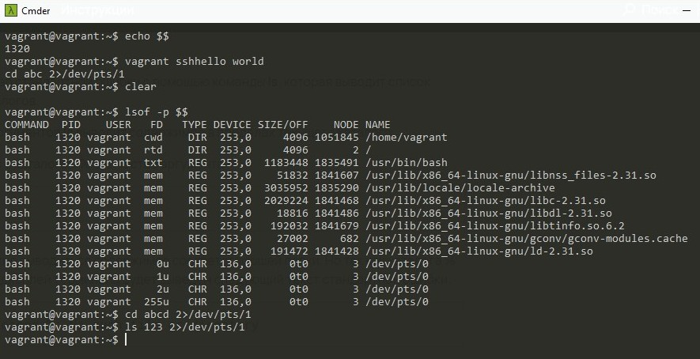
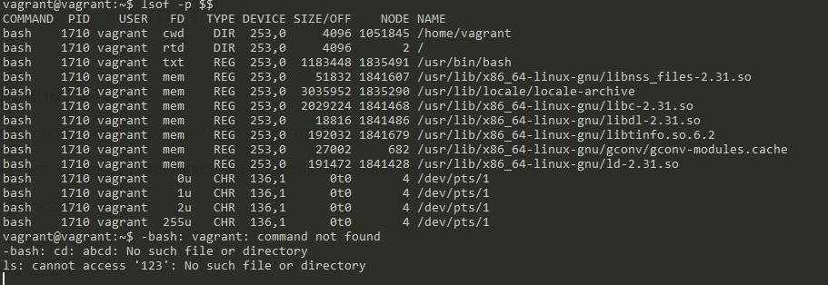

# Домашнее задание к занятию "3.2. Работа в терминале, лекция 2"

cd

Это команда оболочки (sh/bash/...) для смены директории, а не отдельная программа или системный вызов. Она выполняется внутри сессии терминала. Если использовать внешний вызов, то она будет менять директорию среди своего окружения и не будет менять каталог в текущей оболочке.

```
| grep -c
```

3. systemd(1)
4.





```
cat < input-file > output-file
```

6. Вывести можно через перенаправление вывода, но данные не будем наблюдать. Чтобы их увидеть надо перейти в эмулятор терминала с помощью Ctrl + Alt + F1..F6
7. `bash 5>&1` - Создаст дескриптор 5 и перенатправит его в stdout
   `echo netology > /proc/$$/fd/5` - выведет в дескриптор "5", который был пернеаправлен в stdout
8.

```
 8>&2 2>&1 1>&8

8>&2 - новый дескриптор перенаправили в stderr
2>&1 - stderr перенаправили в stdout 
1>&8 - stdout - перенаправили в в новый дескриптор
```

9. cat /proc/$$/environ - выведет набор переменных окружения. Так же, для того, чтобы посмотреть окружение, можно ввести команду env без аргументов.
10.

`/proc/pid/cmdline` - Пользователи не могут получить доступ к файлам и подкаталогам внутри любых каталогов /proc/[pid], кроме своих собственных (каталоги /proc/[pid] остаются видимыми). Конфиденциальные файлы, такие как /proc/[pid]/cmdline и /proc/[pid]/status, теперь защищены от других пользователей. Это делает невозможным узнать, запускает ли какой-либо пользователь конкретную программу (до тех пор, пока программа иначе не выдает себя своим поведением).

`/proc/pid/exe` - В Linux 2.2 и более поздних версиях этот файл представляет собой символическую ссылку, содержащую фактический путь к выполняемой команде. Эта символическая ссылка может быть разыменована обычным образом; попытка открыть его откроет исполняемый файл

разрезаемый. Вы даже можете ввести /proc/[pid]/exe, чтобы запустить другую копию того же исполняемого файла, который запускается процессом [pid]. Если путь был несвязан, символическая ссылка будет содержать строку «(удалено)», добавленную к исходному имени пути. В многопоточном процессе содержимое этой символической ссылки недоступно, если основной поток уже завершен (обычно путем вызова
pthread_exit(3)).

Разрешение на разыменование или чтение (readlink(2)) эта символическая ссылка управляется режимом доступа ptrace
проверка PTRACE_MODE_READ_FSCREDS; см. ptrace(2).

В Linux 2.0 и более ранних версиях /proc/[pid]/exe является указателем на исполняемый двоичный файл и отображается как символическая ссылка.

11. SSE4_2

```

root@vagrant:~# grep sse /proc/cpuinfo
flags           : fpu vme de pse tsc msr pae mce cx8 apic sep mtrr pge mca cmov pat pse36 clflush mmx fxsr sse sse2 ht syscall nx rdtscp lm constant_tsc rep_good nopl xtopology nonstop_tsc cpuid tsc_known_freq pni pclmulqdq ssse3 cx16 pcid sse4_1 sse4_2 x2apic movbe popcnt xsave rdrand hypervisor lahf_lm abm invpcid_single pti fsgsbase invpcid
flags           : fpu vme de pse tsc msr pae mce cx8 apic sep mtrr pge mca cmov pat pse36 clflush mmx fxsr sse sse2 ht syscall nx rdtscp lm constant_tsc rep_good nopl xtopology nonstop_tsc cpuid tsc_known_freq pni pclmulqdq ssse3 cx16 pcid sse4_1 sse4_2 x2apic movbe popcnt xsave rdrand hypervisor lahf_lm abm invpcid_single pti fsgsbase invpcid
```

По умолчанию, когда вы запускаете команду на удаленном компьютере с помощью ssh, для удаленного сеанса не выделяется TTY . Это позволяет вам передавать двоичные данные и т. д. без необходимости иметь дело с причудами TTY. Это среда, предназначенная для команды, выполняемой на computerone.

Однако, когда вы запускаете ssh без удаленной команды, он выделяет TTY, потому что вы, вероятно, будете запускать сеанс оболочки. Это ожидается ssh otheruser@computertwo.com командой, но из-за предыдущего объяснения для этой команды нет TTY.

Если вы хотите, чтобы оболочка была включена computertwo, используйте вместо этого это, что вызовет выделение TTY во время удаленного выполнения:

ssh -t user@computerone.com 'ssh otheruser@computertwo.com'

Делал по этой схеме:

* Запустите длительный процесс, например `top`
* Фон процесса с помощью CTRL-Z
* Возобновите процесс в фоновом режиме: `bg`
* Отобразите запущенные фоновые задания с помощью `jobs -l`, это должно выглядеть так:
  * `[1]+ 4711 Stopped (signal) top`
  * ( `-l`In `jobs -l`гарантирует, что вы получите PID)
* Отключить задания от текущего родителя с помощью `disown top`. После этого `jobs`работу показывать больше не будет, а `ps -a`будет.
* Запустите выбранный мультиплексор терминала, например `tmux`
* Подключиться к фоновому процессу: `reptyr 4711`
* Отключите мультиплексор терминала (например, CTRL-A D) и закройте ssh.
* Переподключите ssh, подключитесь к своему мультиплексору (например `tmux attach`, ).

tee читает из input и пишет в output и в файл. Работает потому что команда запущена от sudo.
